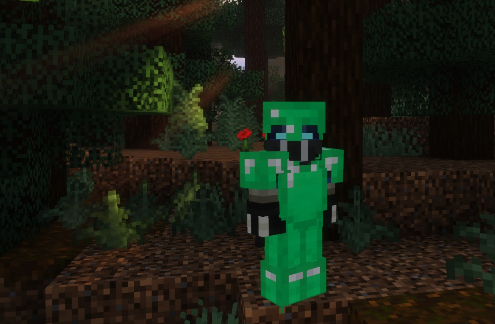
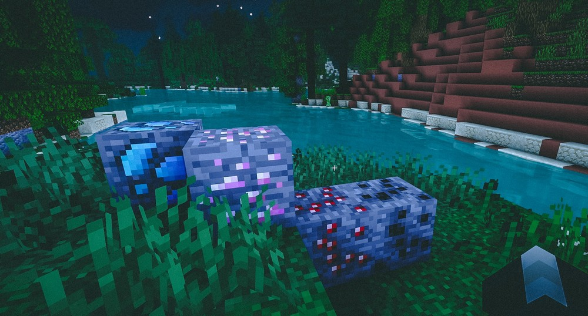
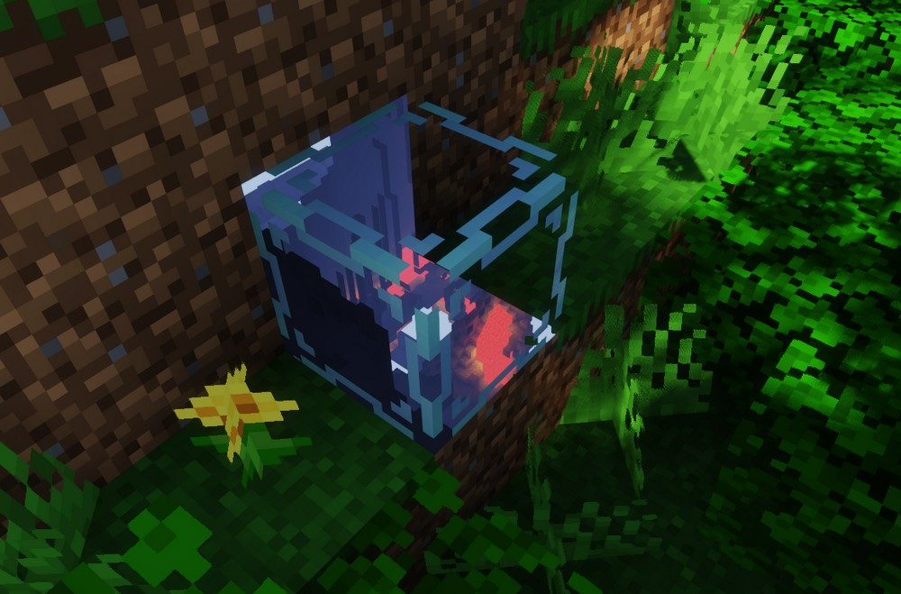
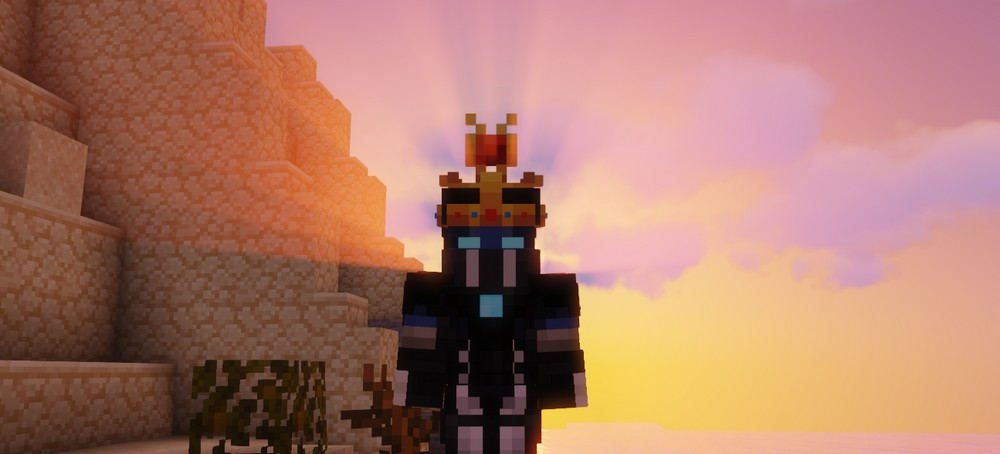
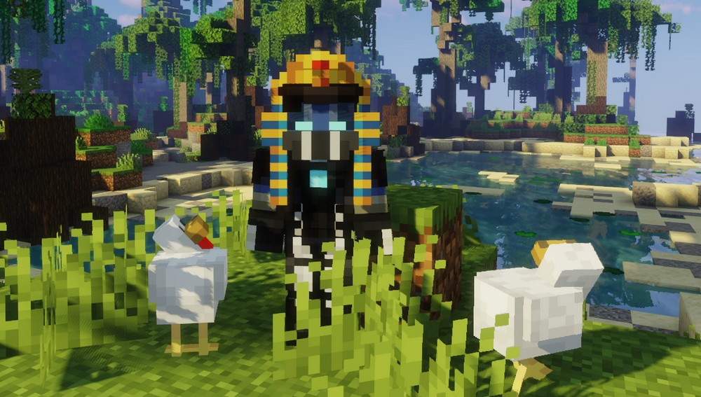
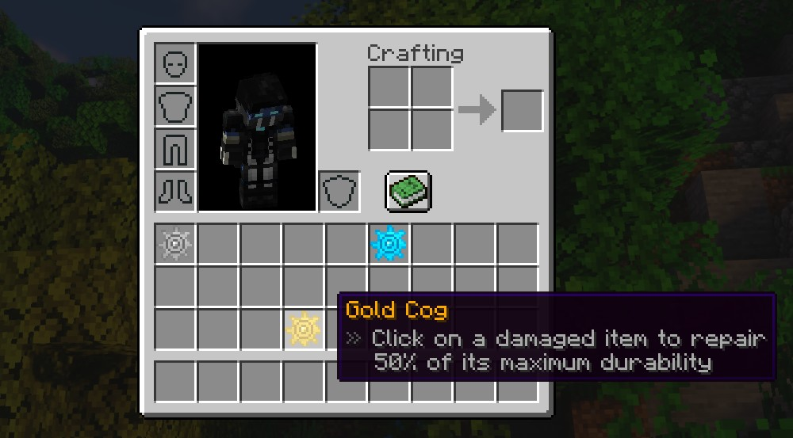
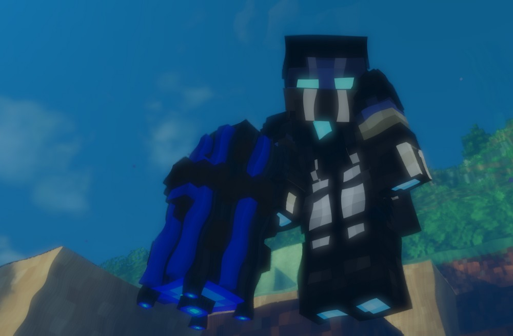
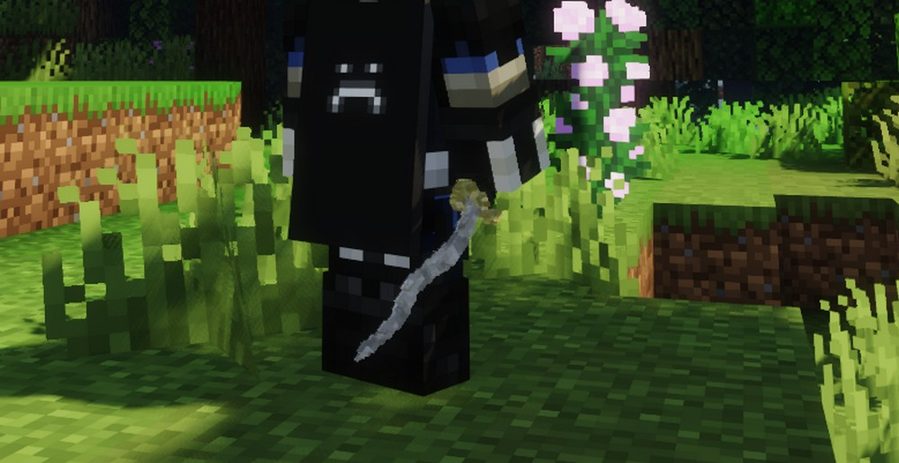
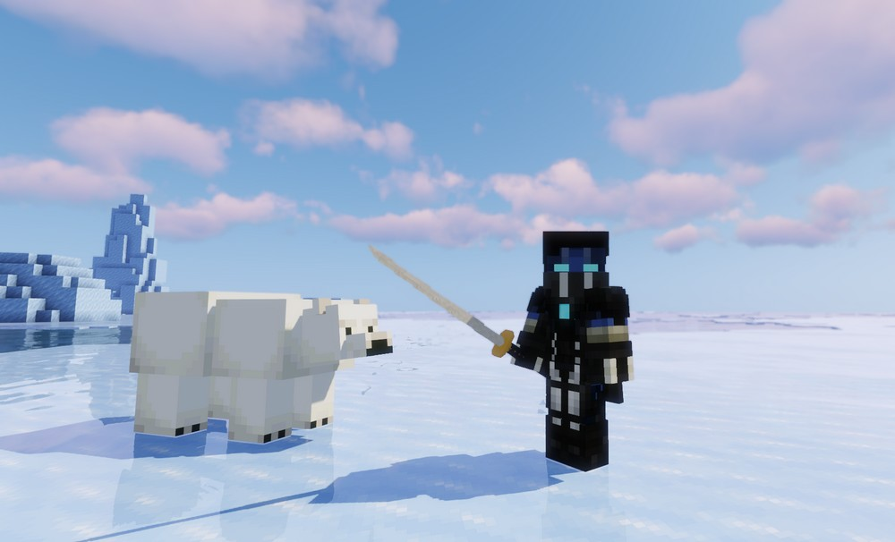

# 默认物品

## 装备

### 绿宝石装备

绿宝石会给玩家更多的血量上限以及防御值(比钻石装备防御高),不过耐久不是很高。

### 黑曜石装备

黑曜石装备的防御并没有钻石装备高,但是耐久高得离谱。

## 方块

### 矿石

奥拉克斯、红宝石、黑玛瑙和紫水晶矿物都拥有贵重的气息。

### X光矿石

X光矿石可以透视后面方块的洞穴。

## 帽子

### 皇冠

一顶十分好看的皇冠能给玩家提供一定的防御值。

### 阿努比斯帽

阿努比斯帽能给玩家提供夜视效果以及一定的防御值。

### 巫师帽

巫师帽能给玩家提供一定的防御值。

### 法老帽

法老帽能给玩家提供一定的防御值。

## 神话物品

### 齿轮

可以使用齿轮修复 Oraxen 或原版中的物品。

## 武器

### 雷击剑

手持右键雷击剑,可以释放一道天雷。

### 神秘法杖

通过释放能量爆炸来攻击实体。

### 威霍克

它拥有十分炫酷的动画,但可惜的是我们并没有给他实现功能,所以你可以自己制作一个功能。

## 其他武器

### 匕首

匕首比正常的剑有更快的攻击速度。

### 能量水晶剑

能量水晶剑的外观十分好看,中部透明。

### 血之剑

血之剑攻击的时候有概率触发吸血技能。

### 日本刀

你知道的,所以我这个就不翻译了。

### 奥克塔维亚剑

奥克塔维亚剑和匕首一样。

### 黑曜石剑

和铁剑的攻击力一样,但是它的耐久度高得离谱。

### 玻璃剑

玻璃剑拥有很高的攻击力,但是耐久度十分低。

## 工具

### 经验之斧

You can use the **axe of experience** to convert your experience into bottles of experience (you'll have to lose a few percentage of experience though).

### Bedrock pickaxe

You can use the **bedrock pickaxe** to break bedrock and go at the top of the nether for example.

### Iron serpe

This tool allows you to harvest: it will automatically recolt and replant wheat!

### Obsidian pickaxe

The **obsidian pickaxe** can be used to break a lot of blocks but is similar to an iron pickaxe.

## Hammers

Hammers are very special pickaxes capable of mining several blocks at the same time. Legend says that they were invented by Notch but he didn't have time to add them so he only drew them into the anvil repair interface.

### **Emerald Hammer**

The most basic hammer you can find is the **Emerald Hammer**, it mines a square of 3 blocks per 3 blocks, this is cool in order to start but definitively not the best you can get.

### Amethyst Hammer

Unlike the Emerald Hammer, the **Amethyst Hammer** mines a square of 3 blocks per 3 blocks too but with a depth of two blocks.

### Onyx Hammer

Take the Amethyst Hammer, improve it and you've got the **Onyx Hammer**. It can break more blocks than the Amethyst Hammer because it has a big durability.

### Orax Hammer

Compared to his brothers, the **Orax Hammer** is a god like hammer : it can mine a really big square with a depth of two blocks.

### Fire Hammer

The **Fire Hammer** mines like a basic hammer (3 blocks per 3 blocks, depth of 1) but it actually melts ores instantly! If you mine iron ore for example you'll immediatly get rewarded with iron ingots ...and it stacks with fortune!
